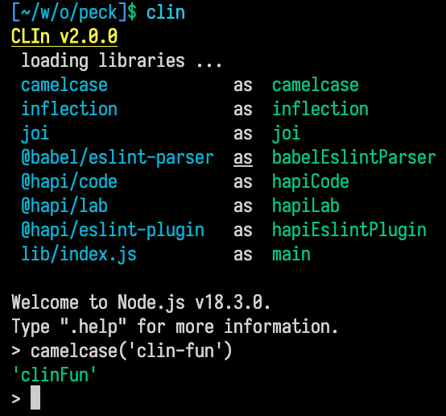

# Clin - Start node REPL with all your dependencies loaded

What ends up happening is I open the CLI a lot but then I have to require the stuff I want to use ... EVERY TIME
This allows me to skip that step

It's the same as running `node` in your local directory, and having ALL the files in your package.json required and available in your CLI.

Because some package names are not suitable for variable names, they get renamed. For example: '@org/foo-bar' is accessible as 'orgFooBar'

The package.json "main" file will always be loaded as `main`

## installation

`npm install -g clin`

or

`yarn global add clin`
